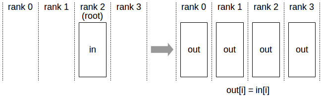
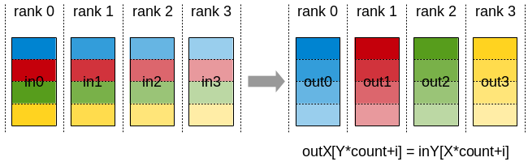

# Collective Operations

In a distributed system, each participating process or device is assigned a unique identifier called a **rank**. A rank can represent a GPU, CPU process, or worker in a distributed job.

## Table of Contents

- [AllReduce](#allreduce)
- [Broadcast](#broadcast)
- [Reduce](#reduce)
- [AllGather](#allgather)
- [ReduceScatter](#reducescatter)
- [AlltoAll](#alltoall)
- [Gather](#gather)
- [Scatter](#scatter)
- [References](#references)

## AllReduce

In an **AllReduce** operation, each rank starts with its own local data. A reduction operation (such as **sum**, **max**, or **min**) is performed across all ranks, and the final result is distributed back to every rank.

For example:


Before AllReduce:

* Rank 0: `in0`
* Rank 1: `in1`
* Rank 2: `in2`
* Rank 3: `in3`

After `AllReduce(sum)`:

* Rank 0: `out = in0 + in1 + in2 + in3`
* Rank 1: `out = in0 + in1 + in2 + in3`
* Rank 2: `out = in0 + in1 + in2 + in3`
* Rank 3: `out = in0 + in1 + in2 + in3`

### Implementation

One way to implement **AllReduce** is using the **butterfly algorithm** (also known as **recursive doubling**). The basic idea is that, at each step, ranks exchange data with a partner whose rank differs by one bit. For example, with four ranks:

**Step 1: Exchange with ranks differing in bit 0**

```text
0 <-> 1
2 <-> 3
```

After performing the reduction:

* Rank 0: `out0 = in0 + in1`
* Rank 1: `out1 = in0 + in1`
* Rank 2: `out2 = in2 + in3`
* Rank 3: `out3 = in2 + in3`

**Step 2: Exchange with ranks differing in bit 1**

```text
0 <-> 2
1 <-> 3
```

After performing the reduction:

* Rank 0: `out = out0 + out2`
* Rank 1: `out = out1 + out3`
* Rank 2: `out = out2 + out0`
* Rank 3: `out = out3 + out1`

At the end of Step 2, every rank contains:

```text
in0 + in1 + in2 + in3
```

which is the result of `AllReduce(sum)`.

For `N` ranks, recursive doubling requires `log2(N)` communication rounds, making it more latency-efficient than ring-based algorithms, which require `2 × (N - 1)` rounds.

### Why is it useful?

* Data may be too large to fit on a single rank, so it is distributed across multiple ranks. AllReduce enables computations across the entire distributed dataset while making the result available on every rank.

* In distributed training, each rank processes a different mini-batch and computes its own gradients. An AllReduce operation is then used to aggregate (typically sum or average) the gradients across all ranks, ensuring that every rank updates its model using the same global gradients.


## Broadcast

A **Broadcast** operation copies data from one rank (the **root rank**) to all other ranks.

For example:



Before Broadcast:

* Rank 0: `None`
* Rank 1: `None`
* Rank 2: `in` (root rank)
* Rank 3: `None`

After `Broadcast(root=2)`:

* Rank 0: `out = in`
* Rank 1: `out = in`
* Rank 2: `out = in`
* Rank 3: `out = in`

### Implementation

One way to implement Broadcast is using a tree-based algorithm. For four ranks with rank 0 as the root:

**Step 1**

```text
0 -> 1
```

Now ranks 0 and 1 have the data.

**Step 2**

```text
0 -> 2
1 -> 3
```

Now all ranks have the data.

This approach completes in `log2(N)` communication rounds for `N` ranks.

### Why is it useful?

* Some data only needs to be generated or loaded once. Instead of having every rank perform the same work, one rank can produce the data and broadcast it to all other ranks.

* Configuration data, metadata, lookup tables, or model checkpoints can be loaded by a single rank and then distributed to all ranks using Broadcast.

* In distributed training, model parameters are often initialized on one rank and broadcast to all ranks so that every worker starts from the same model state.


## Reduce

A **Reduce** operation performs a reduction (such as **sum**, **max**, or **min**) across all ranks and stores the result on a single **root rank**. It is similar to **AllReduce**, except that only the root rank receives the final result (**Reduce + Broadcast ~ AllReduce**).

For example:


Before Reduce:

* Rank 0: `in0`
* Rank 1: `in1`
* Rank 2: `in2`
* Rank 3: `in3`

After `Reduce(sum, root=2)`:

* Rank 0: `None`
* Rank 1: `None`
* Rank 2: `out = in0 + in1 + in2 + in3`
* Rank 3: `None`

### Implementation

One way to implement Reduce is using a tree-based algorithm. For four ranks and root rank 0:

**Step 1**

```text
1 -> 0
3 -> 2
```

After reduction:
* Rank 0: `out0 = in0 + in1`
* Rank 2: `out2 = in2 + in3`

**Step 2**

```text
2 -> 0
```

After reduction:

* Rank 0: `out = out0 + out2`

At the end of Step 2, root rank contains:

```text
in0 + in1 + in2 + in3
```

which is the result of `Reduce(sum, root=0)`.

### Why is it useful?

* The final reduced value is only needed by one rank. It avoids sending the result back to every rank, reducing communication compared to AllReduce. Global statistics such as sums, maxima, minima, or metrics can be aggregated on a single rank for logging, monitoring, or checkpointing.

* For example, during distributed training, each rank may compute its local loss. A `Reduce(sum)` operation can aggregate the losses on rank 0, which then computes and logs the global loss for monitoring purposes.


## AllGather

An **AllGather** operation collects data from all ranks and distributes the complete result to every rank. Unlike **AllReduce**, no reduction operation is performed. The gathered data is concatenated in rank order.

For example:


Before AllGather:

* Rank 0: `in0`
* Rank 1: `in1`
* Rank 2: `in2`
* Rank 3: `in3`

After `AllGather()`:

* Rank 0: `out = [in0, in1, in2, in3]`
* Rank 1: `out = [in0, in1, in2, in3]`
* Rank 2: `out = [in0, in1, in2, in3]`
* Rank 3: `out = [in0, in1, in2, in3]`

### Implementation

One way to implement **AllGather** is using the **butterfly algorithm** (also known as **recursive doubling**).

**Step 1**

```text
0 <-> 1
2 <-> 3
```

After gathering:

* Rank 0: `out0 = concat(in0, in1)`
* Rank 1: `out1 = concat(in0, in1)`
* Rank 2: `out2 = concat(in2, in3)`
* Rank 3: `out3 = concat(in2, in3)`

**Step 2**

```text
0 <-> 2
1 <-> 3
```

After gathering:

* Rank 0: `out = concat(out0, out2)`
* Rank 1: `out = concat(out1, out3)`
* Rank 2: `out = concat(out0, out2)`
* Rank 3: `out = concat(out1, out3)`

At the end of Step 2, every rank contains:

```text
concat(in0, in1, in2, in3)
```

which is the result of `AllGather()`.

### Why is it useful?

* The full dataset or tensor is needed on every rank, rather than a reduced summary such as a sum, maximum, or minimum; However, the data is initially distributed across ranks and must be reconstructed before computation.

* For example, in distributed training, the parameters of a layer may be partitioned across multiple ranks. Before a forward or backward computation, an **AllGather** operation can collect all parameter shards so that each rank has access to the complete parameters required for computation.


## ReduceScatter

A **ReduceScatter** operation first partitions the data on each rank into chunks, performs a reduction operation on corresponding chunks across all ranks, and then scatters the reduced chunks so that each rank receives one chunk of the final result. The complete reduced result can be reconstructed by applying **AllGather** after **ReduceScatter** (**ReduceScatter + AllGather ~ AllReduce**).


For example:


Before ReduceScatter:

* Rank 0: `in0 = [in0_0, in0_1, in0_2, in0_3]`
* Rank 1: `in1 = [in1_0, in1_1, in1_2, in1_3]`
* Rank 2: `in2 = [in2_0, in2_1, in2_2, in2_3]`
* Rank 3: `in3 = [in3_0, in3_1, in3_2, in3_3]`

After `ReduceScatter(sum)`:

* Rank 0: `out0 = in0_0 + in1_0 + in2_0 + in3_0`
* Rank 1: `out1 = in0_1 + in1_1 + in2_1 + in3_1`
* Rank 2: `out2 = in0_2 + in1_2 + in2_2 + in3_2`
* Rank 3: `out3 = in0_3 + in1_3 + in2_3 + in3_3`

### Implementation

One way to implement **ReduceScatter** is using the **butterfly algorithm**.

**Step 1**

```text
0 <-> 2
1 <-> 3
```

Each rank exchanges half of its chunks with its partner and performs the reduction on the received chunks.

After reduction:

* Rank 0: `[in0_0 + in2_0, in0_1 + in2_1]`
* Rank 1: `[in1_0 + in3_0, in1_1 + in3_1]`
* Rank 2: `[in0_2 + in2_2, in0_3 + in2_3]`
* Rank 3: `[in1_2 + in3_2, in1_3 + in3_3]`

**Step 2**

```text
0 <-> 1
2 <-> 3
```

Each rank exchanges half of its remaining chunks and performs another reduction.

After reduction:

* Rank 0: `out0 = in0_0 + in1_0 + in2_0 + in3_0`
* Rank 1: `out1 = in0_1 + in1_1 + in2_1 + in3_1`
* Rank 2: `out2 = in0_2 + in1_2 + in2_2 + in3_2`
* Rank 3: `out3 = in0_3 + in1_3 + in2_3 + in3_3`

At the end of the final step, each rank holds one reduced chunk of the overall result.

### Why is it useful?

* It is similar to AllReduce, but instead of every rank receiving the complete reduced result, each rank receives only a portion of the reduced result. This is useful when the result is too large to fit on a single rank or when only a portion of the result is needed for the next computation.

<!-- * We can obtain the complete result by applying AllGather after ReduceScatter. Sometimes, we want to transform the reduced portion of the data in parallel before gathering the complete data on each rank. -->

* In distributed training, each rank may compute gradients using different batches of data, while model parameters are sharded across ranks. ReduceScatter can be used to aggregate gradients and distribute only the gradient shard corresponding to each rank's parameter shard.

## AlltoAll

Similar to **ReduceScatter**, but without performing any reduction. Each rank splits its input into chunks and sends the *j-th* chunk to rank *j*. In return, each rank receives one chunk from every other rank, ordered by the source rank.

For example:



Before AlltoAll:

* Rank 0: `in0 = [in0_0, in0_1, in0_2, in0_3]`
* Rank 1: `in1 = [in1_0, in1_1, in1_2, in1_3]`
* Rank 2: `in2 = [in2_0, in2_1, in2_2, in2_3]`
* Rank 3: `in3 = [in3_0, in3_1, in3_2, in3_3]`

After `AlltoAll()`:

* Rank 0: `out0 = [in0_0, in1_0, in2_0, in3_0]`
* Rank 1: `out1 = [in0_1, in1_1, in2_1, in3_1]`
* Rank 2: `out2 = [in0_2, in1_2, in2_2, in3_2]`
* Rank 3: `out3 = [in0_3, in1_3, in2_3, in3_3]`

### Implementation


One way to implement **AlltoAll** is through a sequence of pairwise exchanges. For four ranks:

**Step 1**

Each rank keeps the chunk intended for itself:

```text
Rank 0 keeps in0_0
Rank 1 keeps in1_1
Rank 2 keeps in2_2
Rank 3 keeps in3_3
```

**Step 2**

Ranks exchange chunks with their peers:

```text
0 <-> 1
0 <-> 2
0 <-> 3
1 <-> 2
1 <-> 3
2 <-> 3
```

After all exchanges are completed:

* Rank 0: `[in0_0, in1_0, in2_0, in3_0]`
* Rank 1: `[in0_1, in1_1, in2_1, in3_1]`
* Rank 2: `[in0_2, in1_2, in2_2, in3_2]`
* Rank 3: `[in0_3, in1_3, in2_3, in3_3]`


### Why is it useful?

* Unlike AllGather, each rank receives only the portion of data it needs instead of the complete dataset, reducing memory usage.

* Unlike ReduceScatter, no reduction is performed. Each rank receives data from every other rank while preserving the original information. This is useful when the next computation requires reorganizing data rather than aggregating it.

<!-- * You do not need the complete result, but you also do not want to reduce those portions of the data because subsequent operations may require the data to remain intact. -->

<!-- * In distributed training, we can load a subset of the model's layers on each rank and then use AlltoAll to distribute portions of the parameters from those layers across all ranks. Partitioning the model by layers at the beginning is often simpler than partitioning individual parameters. This approach allows us to distribute each layer's parameters using AlltoAll. -->

* In distributed training, different portions of data may need to be processed by different ranks. AlltoAll redistributes the data so that each rank receives the portions assigned to it for computation.  <!-- This pattern is commonly used in Mixture-of-Experts (MoE) models for routing tokens to experts. -->

## Gather

A **Gather** operation collects data from all ranks and stores the result on a single root rank. It is similar to AllGather, except that only the root rank receives the final result.

For example:


Before Gather:

* Rank 0: `in0`
* Rank 1: `in1`
* Rank 2: `in2`
* Rank 3: `in3`

After `Gather(root=2)`:

* Rank 0: `None`
* Rank 1: `None`
* Rank 2: `out = [in0, in1, in2, in3]`
* Rank 3: `None`

### Implementation

One way to implement Gather is using a tree-based algorithm. For four ranks and root rank 0:

**Step 1**

```text
1 -> 0
3 -> 2
```

After Gather:
* Rank 0: `out0 = concat(in0, in1)`
* Rank 2: `out2 = concat(in2, in3)`

**Step 2**

```text
2 -> 0
```

After Gather:
* Rank 0: `out = concat(out0, out2)`

At the end of Step 2, root rank contains:

```text
concat(in0, in1, in2, in3)
```

which is the result of `Gather(root=0)`.

### Why is it useful?

* The complete result is only needed by one rank, so gathering to a single root rank avoids the communication overhead of distributing it to all ranks. Also, It is useful when data from all ranks must be collected without applying a reduction operation.

* In distributed training, model parameters, gradients, or optimizer states may be sharded across ranks. A Gather operation can collect these shards onto a single rank for checkpointing, saving, exporting, or deployment.

## Scatter

A **Scatter** operation distributes data from a single root rank to all ranks. The input data on the root rank is divided into chunks, and each rank receives one chunk.

For example:


Before Scatter:

* Rank 0: `None`
* Rank 1: `None`
* Rank 2: `in = [in0, in1, in2, in3]`
* Rank 3: `None`

After `Scatter(root=2)`:

* Rank 0: `out0 = in0`
* Rank 1: `out1 = in1`
* Rank 2: `out2 = in2`
* Rank 3: `out3 = in3`

### Implementation

One way to implement Scatter is using a tree-based algorithm. For four ranks and root rank 0:

**Step 1**

```text
0 -> 2
```

Rank 0 sends half of the data to rank 2.

After the transfer:

* Rank 0: `out0 = [in0, in1]`
* Rank 2: `out2 = [in2, in3]`

**Step 2**

```text
0 -> 1
2 -> 3
```

After the transfers:

* Rank 0: `out0 = in0`
* Rank 1: `out1 = in1`
* Rank 2: `out2 = in2`
* Rank 3: `out3 = in3`

At the end of Step 2, each rank contains its assigned chunk.

### Why is it useful?

* Only one rank needs to load or generate the data, while all ranks participate in processing different portions of it.

* It distributes work efficiently across ranks without requiring every rank to hold the complete dataset.

* In distributed training, a root rank may load a batch of data and use Scatter to distribute different portions of the batch to worker ranks for parallel processing.


## References

* [NCCL Collectives Documentation](https://docs.nvidia.com/deeplearning/nccl/user-guide/docs/usage/collectives.html)
* [PyTorch Distributed Documentation](https://docs.pytorch.org/docs/2.12/distributed.html)

## Note

- The implementation section is intentionally abstract and focuses on the conceptual design rather than the details of the actual code implementation.